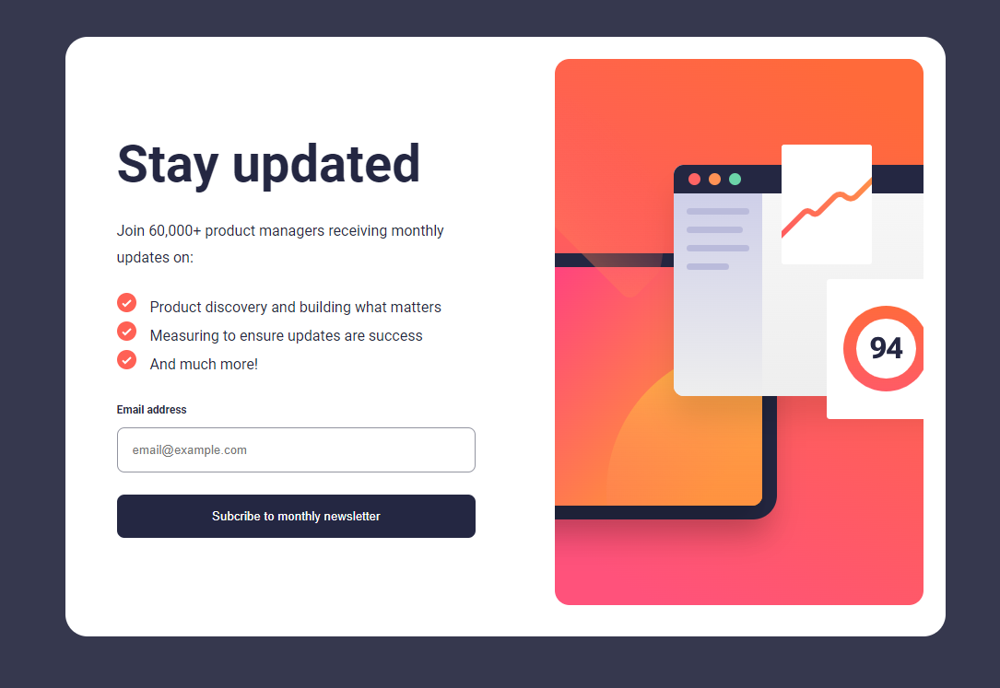

# Newsletter SignUp Page

Este proyecto es una página de registro para un boletín informativo, donde los usuarios pueden ingresar su dirección de correo electrónico para suscribirse al boletín. La página está diseñada con HTML, CSS y JavaScript, y tiene la capacidad de validar la dirección de correo electrónico ingresada por el usuario y mostrar un mensaje de éxito una vez que se ha enviado el formulario de suscripción.

## Características principales:
- **Formulario de suscripción:** Los usuarios pueden ingresar su dirección de correo electrónico en el formulario de suscripción.
- **Validación de correo electrónico:** Se valida la dirección de correo electrónico ingresada por el usuario para asegurarse de que sea válida antes de enviar el formulario.
- **Mensaje de éxito:** Después de enviar con éxito el formulario de suscripción, se muestra un mensaje de éxito al usuario, junto con detalles sobre la confirmación por correo electrónico.

## Tecnologías utilizadas:
- **HTML:** Para la estructura y el contenido de la página.
- **CSS:** Para estilos y diseño visual.
- **JavaScript:** Para la funcionalidad interactiva del formulario y la validación de datos.

  

## Instrucciones de uso:
1. **Ingresar dirección de correo electrónico:** Escribe tu dirección de correo electrónico en el campo provisto en el formulario de suscripción.
2. **Enviar formulario:** Haz clic en el botón "Suscribirse al boletín" para enviar el formulario.
3. **Validación de correo electrónico:** Se realizará una validación de la dirección de correo electrónico ingresada para garantizar que sea válida.
4. **Mensaje de éxito:** Después de enviar con éxito el formulario, se mostrará un mensaje de éxito al usuario, indicando que la suscripción se ha realizado correctamente.

## Contribuir:
¡Siéntete libre de contribuir a este proyecto! Puedes abrir problemas, enviar solicitudes de extracción o mejorar la documentación según sea necesario. Cualquier contribución es bienvenida y apreciada.

## Autor:
Desarrollado por [Carlos Linares] ([KarlangaXZ](https://github.com/KarlangaXZ)).

¡Gracias por revisar este proyecto! Esperamos que encuentres útil esta página de registro de boletines informativos. Si tienes alguna pregunta o sugerencia, no dudes en comunicarte con nosotros.
